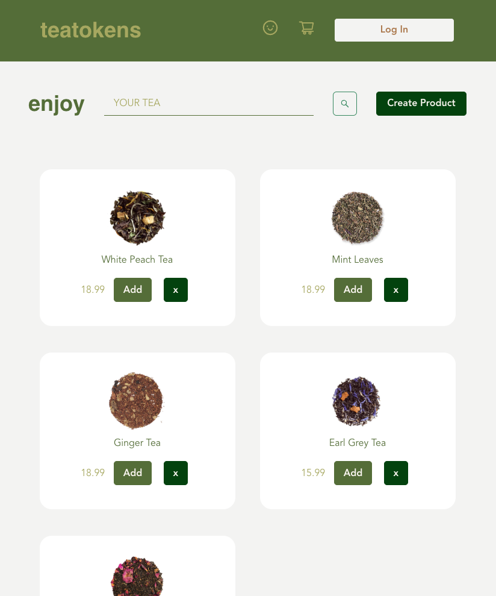

# TeaTokens

<!-- PROJECT TITLE -->
 

  
  

   Teatokens is an online tea shop that sells pictures of your favorite tea!
     

If you've ever wanted to own your favorite teas in the form of an online image, Teatokens has the services you desire. This e-commerce website allows you to create an account and purchase images of tea to keep. Each one is uniquely your own in that you bought it, and there is a limited stock of each one. Buy your tea today and make it yours!

\_</b>  </b> 

## Deployed Site Teatokens:

Check out Teatokens when it is ready! The link will be available here. In the meantime, download and open it with a code editor.

## Technologies Used

JavaScript
React Hooks
PostgreSQL
Sequelize
Node
Express
Chakra UI

## Development Team:

Special thanks to Vida Feng, Franz Mutagas, and Dooz Yu for collaborating with me for the concept of this website as well as the first version which uses React-Redux.
