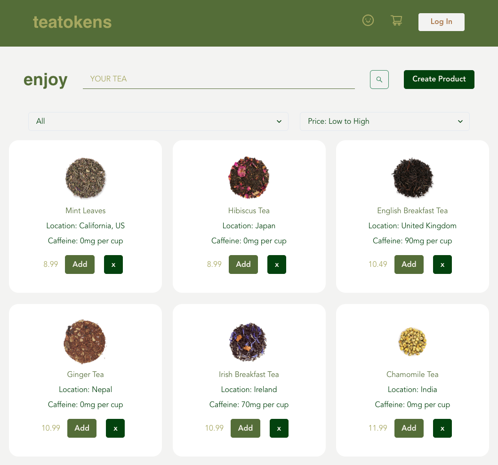
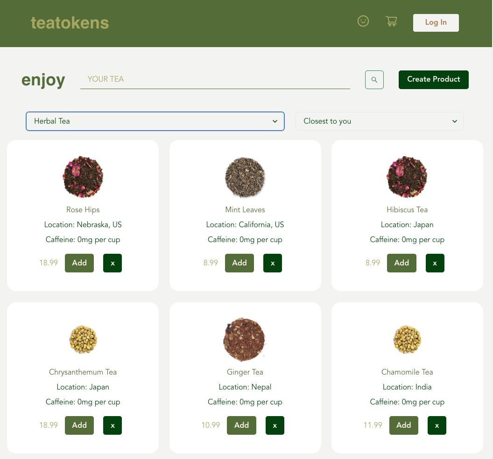

# TeaTokens

<!-- PROJECT TITLE -->
 

  
  

   Teatokens is an online tea shop that sells your favorite tea from all over the world!
     

If you've ever wanted to get your favorite teas as locally as possible, Teatokens has the services you desire. This e-commerce website allows you to create an account and purchase tea. Buy your favorite teas and those that are closest to you to cut back on the environmental costs of importing and exporting goods. We're working hard to expand our stock and bring you more options. For each purchase, you'll earn tokens you can exchange for more tea or even a ticket to one of our production sites around the world!

\_</b>    </b> 

## Deployed Site Teatokens:

Check out Teatokens when it is ready! The link will be available here. In the meantime, download and open it with a code editor.

## Technologies Used

JavaScript
React Hooks
PostgreSQL
Sequelize
Node
Express
Chakra UI

## Development Team:

Special thanks to Vida Feng, Franz Mutagas, and Dooz Yu for collaborating with me for the concept of this website as well as the first version which uses React-Redux.
